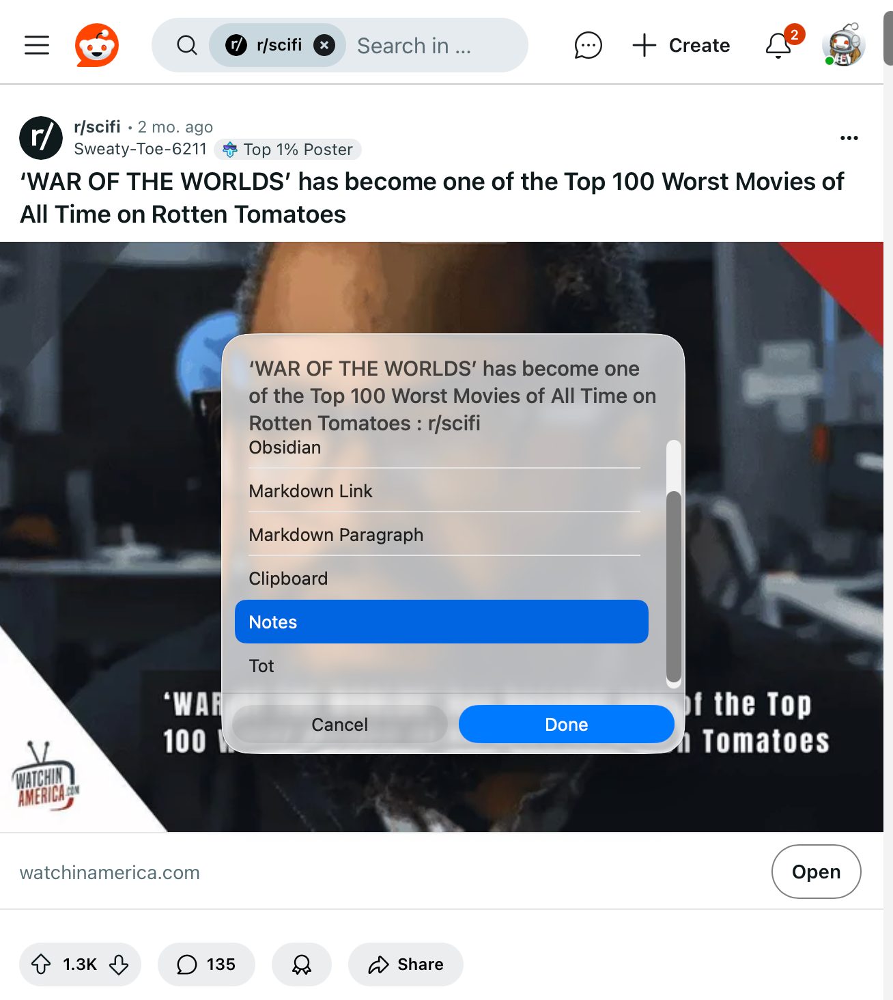
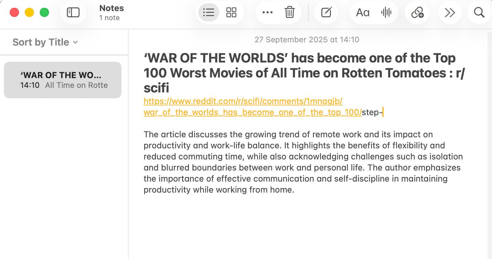

# LinkUp

## Introduction

This is a project that allows the easy creation of files that link between applications on MacOS/iOS. A familiarity with Keyboard Maestro and Siri Shortcuts is assumed.

**Usage**: for example when in Mail, Maps, Calendar, Safari etc. easily create a todo or note with a useful title, content and link back to the original item.

On a Mac the process is:

1. **Capture**: Hit a [Keyboard Maestro](https://www.keyboardmaestro.com) hot key sequence in your source application (I use: CTRL + ⌥ + ⌘ + L).
2. **Choose**: a destination application from a menu.
3. **Create**: an entry in the destination app which opens populated with a title, note and link back to the original item if possible.

On iOS/iPadOS the process is:

1. **Capture**: share from the source application to a Siri Shortcut called ```ShareFrom-<AppName>```.
2. **Choose**: a destination application from a menu.
3. **Create**: an entry in the destination app which opens populated with a title, note and link back to the original item if possible.

The capture and choose steps are common across MacOS and iOS/iPadOS.

For example, suppose you are in Safari on a Mac and you want to create a note from the current page. Just hit the hot key sequence, and choose Notes. 



This creates the following Apple Notes note:



The main difficulty is capture in circumstances where the source application may not conveniently provide the information we want. This will be discussed on a case by case basis later.

## Structure

This is a collection of Keyboard Maestro macros and Siri Shortcuts that fall into three main categories.

**1. Capture**

On MacOS this is done with a mix of Keyboard Maestro (KM) scripts (```Link-<AppName>```). KM gathers information from the application, builds a dictionary with parameters and then calls the shortcut.

On iOS/iPadOS this is done with shortcuts (```ShareFrom-<AppName>```) configured as share targets.

Both of the above then call a common set of shortcuts (```LinkFrom-<AppName>```) that do whatever additional work is required to fill in the parameter dictionary to include:

- Title
- Note
- URL
- Latitude, Longitude (for locations)

This is then passed to a single shortcut in step 2.

**2. Destination Choice**

This is a single shortcut that prompts the user for the destination application.

**3. Create Chosen Item**

This is a set of shortcuts (```LinkTo-<AppName>```) that builds whatever you asked for in step 2 and ideally opens it.

## Supported Applications

Source Applications:
- Mail (Mac Only)
- Safari
- OmniFocus
- Calendar
- Obsidian
- Apple Maps

Destination Applications:
- OmniFocus
- Obsidian
- Tot
- Apple Notes
- Webloc files

### Safari (Source)

- [Link-Safari](Link-Safari.kmmacros)
- [LinkFrom-WebPage](LinkFrom-WebPage.shortcut)

**URL**: In Safari it's quite easy to capture the URL, KM can easily capture the current URL and on iOS/iPadOS the url can be shared.

**Title**: In the shortcut we use URL and **Get Article using Safari Reader**. This provides the title.

**Note**: The article we fetched above also contains the content, which we optionally pass to the local Apple AI model to generate a summary.

### Mail (Source, Mac Only)

- [Link-Mail](Link-Mail.kmmacros)
- [LinkFrom-Mail](LinkFrom-Mail.shortcut)

Unfortunately iOS/iPadOS do not provide a share menu from Mail.

**URL**: KM has to use a fragment of AppleScript to get a mail URL.

**Title**: captured with KM.

**Note**: This is empty.

### Maps (Source)

- [Link-Maps](Link-Maps.kmmacros)
- [LinkFrom-Maps](LinkFrom-Maps.shortcut)
- [ShareFrom-Maps](ShareFrom-Maps.shortcut)

Apple seems to have recently changed Maps to share a shortened URL rather than either a URL with parameters or a "Location" object. Also the new Liquid Glass UI breaks the the KM feature that can find the menu hidden behind the ```...``` menu which is where Copy Coordinates hides on the Mac. This eliminates any documented way of extracting any information from what's shared from Maps. However after some experimentation I discovered that ```Expand URL``` in Shortcuts will take the shortened URL and return one that contains the address and coordinates.

**URL**: Use the shortened one.

**Title**: Use the **name** from the expanded URL.

**Latitude/Logitude**: From the expanded URL:

**Note**: The address from the expanded URL and also links to the same location in several other maps services like Google Maps, Open Street Map and the Ordnance Survey.